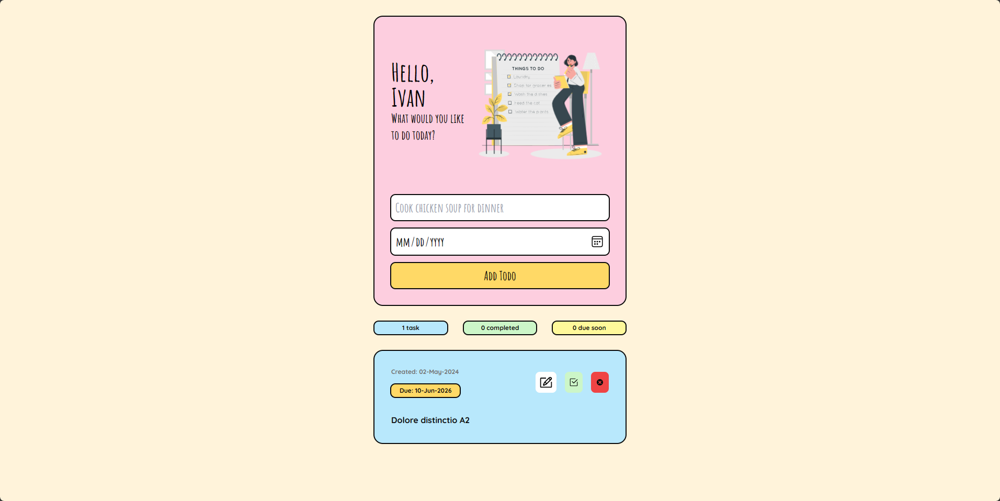

# vertex-todo-test

### Alexander Ivan

I wanted to use Laravel or Headless CMS, but i dont think the time is enough for me to implement it. So i decided to
leverage local storage for this project.

**Also i have problem with Vuex, so i decided to use Pinia for this project, since almost the same with Vuex.**

All logic are separated, i put all the logic in pinia store, and the components are just for rendering and fetching data
from store.

# Live Project Url
You can see live version here:
[https://vertex-todo-test.vercel.app/](https://vertex-todo-test.vercel.app/)

### Tech Stack
- Vue 3
- Pinia
- TailwindCSS
- Vite
- Typescript
- Local Storage
- Eslint

### Structure
- `src` - Contains all the source code
- `src/components` - Contains all the components
- `src/store` - Contains all the pinia store
- `src/types` - Contains all the typescript types
- `src/utils` - Contains all the utility functions
- `src/views` - Contains all the views
- `src/App.vue` - Main App component
- `src/main.ts` - Main entry file
- `src/router.ts` - Contains all the routes
- `src/shims-vue.d.ts` - Contains all the typescript types for vue
- `src/styles` - Contains all the global styles

### How to run the project
- Clone the project
- Run `pnpm install`
- Run `pnpm dev`
- Open `http://localhost:3000` in your browser

### How to build the project
- Run `pnpm build`
- The build will be in the `dist` folder